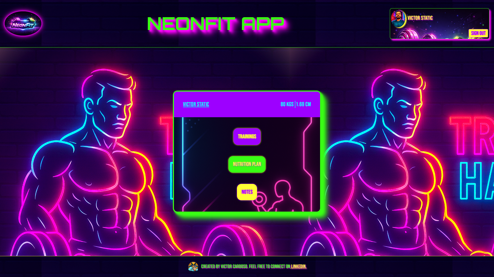

    

# Training App

 > ℹ️ **NOTE 1:** Este é um repositório desenvolvido durante os meus estudos de Front End, com o objetivo de aprimorar meus conhecimentos nesse tema. Este projeto estará em constante evolução para melhorar o desempenho e a otimização do código.

  > ℹ️ **NOTE 1:** This repository was developed during my Front-End studies, with the goal of improving my knowledge in this area. The project will continue to evolve to enhance performance and code optimization.

## ✨ Features
✅ Bem vindos! Este é um projeto com o objetivo de criar uma aplicação em React com temática de treinamento, fornecendo informações, músicas e timer em tempo real de forma organizada para maximizar a performance dos treinos. Esta aplicação será utilizada por praticantes de atividade física durante suas rotinas de treino, alimentação e descanso. Minha gratidão a Deus pela finalização do projeto.

<!-- Possui funcionalidades de ler, criar, atualizar e remover cards de forma funcional e dinâmica. -->

✅ Welcome! This project aims to develop a React-based application focused on training, providing structured access to information, music, and real-time timers to optimize workout performance. The application is designed to be used by individuals engaged in physical activity throughout their training routines, nutrition, and recovery. I am grateful to God for the completion of this project. 

<!-- The application implements full CRUD (Create, Read, Update, Delete) operations for managing cards in a dynamic and efficient manner, ensuring a responsive and interactive user experience. -->

<a href="https://training-app-liard-ten.vercel.app/" title="View Project now"> 📟 Click here to view the application</a> 
<a href="https://github.com/VictorSamuraiWol/training-app" title="View Repository now"> 📜 Click here to view the repository</a>

## 💻 Technologies used in the project

- [Trello](https://trello.com/) 
- [Visual Studio Code](https://code.visualstudio.com/)
- [HTML](https://html.com/) 
- [CSS](https://www.w3.org/Style/CSS/Overview.en.html)
- [JavaScript](https://www.javascript.com/)
- [React](https://react.dev/)
- [Json-Server](https://www.npmjs.com/package/json-server)
- [Vite](https://vite.dev/)
- [Google Fonts](https://fonts.google.com/)
- [React Icons](https://react-icons.github.io/react-icons/)
- [ChatGPT](https://chatgpt.com/)
- [Claude](https://claude.ai/new)
- [NemoVideo](https://www.nemovideo.com/workspace)
- [Nano Banana](https://gemini.google/br/overview/image-generation/?hl=pt-BR)
- [Ezgif](https://ezgif.com/)
- [Microsoft Designer](https://designer.microsoft.com/)
- [Github](https://github.com/)
- [Vercel](https://vercel.com/)

##  AWS and Oracle Certified in Cloud Computing, Front-End Student 
 

    
    
&nbsp&nbsp&nbspVictor Cardoso 
    &nbsp&nbsp&nbsp
    <a 
        href="https://github.com/VictorSamuraiWol">
        GitHub
    </a>
    &nbsp;|&nbsp;
    <a 
        href="https://www.linkedin.com/in/victor-cardoso-cloud-front/">
        LinkedIn
    </a>
    &nbsp;|&nbsp;
    

 

---

⌨️ with 💚 by [Victor Cardoso](https://github.com/VictorSamuraiWol)
